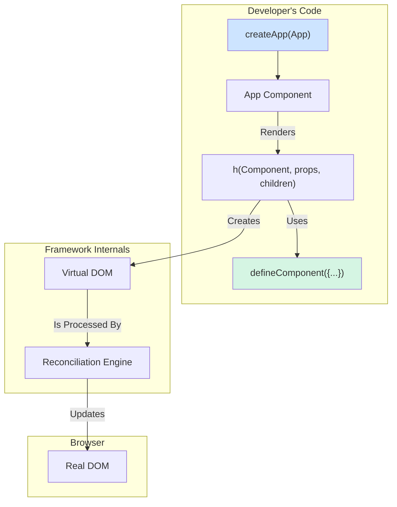

A lightweight, modern frontend framework for building declarative, component-based user interfaces with JavaScript.
## Overview of Architecture:




### Core Systems:

1. **Component Model (The Building Blocks)** : The UI is built by composing encapsulated, stateful **Components**. Each component manages its own state and view. Components receive data from parents via **props** and communicate upwards by emitting **events**, ensuring a predictable, one-way data flow.

2. **Virtual DOM & Reconciliation (The Rendering Engine)** : Instead of manipulating the real DOM directly, the framework uses a **Virtual DOM**—a lightweight JavaScript representation of the UI. When a component's state changes, a new Virtual DOM is created. The **Reconciliation Algorithm** then efficiently compares the new and old virtual trees, calculates the minimal set of changes, and applies only those changes to the real DOM.

3. **Client-Side Router (The Navigator)** : The framework includes a client-side **Router** that maps URL paths to specific components. Using the browser's History API, the router handles navigation between different views without requiring a full page reload, providing a seamless single-page application experience.

### Design Principles:

- **Separation of Concerns:** The framework separates application logic from low-level **DOM manipulation**, allowing developers to focus on "what" the view should be, rather than "how" it's built or updated
- **Declarative Programming:** Views are defined declaratively, with the framework handling the imperative Document API operations

## Key Features :

### Component-Based Architecture

Build your UI by composing small, reusable, and encapsulated components.

- **Stateful Components**: Each component manages its own logic and view. State is defined in a `state()` method and updated via `this.updateState()`, which automatically triggers a re-render.
- **Component Communication**: A predictable data flow is ensured through props and events.

    - **Props (Parent to Child)**: Pass data down to child components via the `props` object in the `h()` function. The child can access this data using `this.props`.

    - **Events (Child to Parent)**: Communicate up to parent components by emitting custom events with `this.emit('eventName', payload)`. Parents listen for these events using the `on: { eventName: ... }` prop.

- **Lifecycle Hooks**: Run code at critical moments in a component's life.

    - **`onMounted()`**: Executes right after the component is mounted to the DOM, ideal for fetching initial data.

    - **`onUnmounted()`**: Executes right after the component is removed from the DOM, ideal for cleanup.

- **Reusability with Slots**: Create reusable layout components (like cards or modals) with designated **slots**. This allows a parent component to project its own content directly into a child's template.
### Efficient Rendering Engine

Instead of re-rendering the entire page on every change, this framework ensures your application is fast and responsive.

- **Virtual DOM**: We use a lightweight, in-memory representation of the UI allows for fast calculations without touching the slow, real DOM.

- **Reconciliation**: A smart diffing algorithm compares the virtual DOM trees, calculates the minimal set of changes, and applies only those patches to the real DOM.

- **Keyed Lists**: Performance is further optimized in lists by using a `key` attribute, which helps the framework efficiently track, move, and update elements.

### Modern Developer Experience

The framework includes modern APIs to handle common web development challenges declaratively.

- **Client-Side Routing**: Build fast Single-Page Applications (SPAs) with the built-in `Router` components, which handle navigation without full page reloads.

- **Declarative Event Handling**: Control event behavior directly in your templates with modifiers like `'click.stop'` and `'click.prevent'`, keeping your logic clean.

- **Asynchronous Testing**: Use the `nextTick()` utility to reliably test components that have asynchronous behavior.

## Installation instructions

#### 1. Clone the Repository

```bash
git clone https://github.com/your-username/your-repo.git
cd your-repo
```

#### 2. Install Dependencies

Run the command from the **root directory**

```bash
npm install
```

#### 3. Build the Framework

Navigate to the `runtime` package and run the build script

```bash
cd packages/runtime
npm run build
```

#### 4. Run the Example Project

Navigate back to the root directory and run the server for the example applications

```bash
npm run serve:examples
```

You can then navigate to the example you'd like to test

## Users Guide - API Reference

These are the functions and components you will import to build your application.

### Application

`createApp(RootComponent, props = {})`

Initializes and creates an application instance. This is the main entry point for any application.

- **Parameters**:

    - `RootComponent` (Component): The top-level component for your application.

    - `props` (Object, optional): An object of initial props to pass to the root component.

- **Returns**: An `Application` instance with two methods:

    - `.mount(domElement)`: Renders the application into a container DOM element.

    - `.unmount()`: Destroys the application instance and removes it from the DOM.

**Example**:

```js
import { createApp } from 'august-js-fwk';
import { App } from './App.js';

const app = createApp(App);
app.mount(document.getElementById('app'));
```

---
### Components

`defineComponent({ ... })`

Defines a stateful component. It accepts an object that describes the component's logic and view.

**Configuration Object Properties**:

- `state(props)` (Function, optional): A function that returns the component's initial state object. It receives the component's initial `props` as an argument.

- `render()` (Function, required): A function that returns the component's Virtual DOM tree using the `h()` functions. `this` is bound to the component instance, so you can access `this.state` and `this.props`.

- `onMounted()` (Function, optional): A lifecycle hook that runs right after the component is mounted to the DOM.

- `onUnmounted()` (Function, optional): A lifecycle hook that runs right after the component is removed from the DOM.

- `[customMethod()]` (Function, optional): Any other methods on the object are attached to the component and can be used as event handlers.

**Note:** A concrete example can be found in the **Getting Started** section below.

---
### Rendering

These are the functions used inside a `render()` method to create the Virtual DOM.

- **`h(tag, props, children)`**: Creates an element or component node.

    - `tag` (String | Component): An HTML tag name (e.g., `'div'`) or a component definition.

    - `props` (Object): An object of attributes, props, and event handlers (`on: { ... }`).

    - `children` (Array): An array of child virtual nodes.

- **`hFragment(children)`**: Creates a fragment to group multiple nodes

- **`hString(text)`**: Creates a text node.

- **`hSlot()`**: Defines a slot where a parent can project content.

**Example**:

```js
const ListItem = defineComponent({ 
  render() { 
    // hFragment is used to group multiple root-level nodes 
    return hFragment([ 
      // hString creates a simple text node 
      hString('Item: '), 
      // h() creates a standard HTML element 
      h('span', { style: 'font-weight: bold;' }, ['My List Item']), 
    ]); 
  } 
});
```

---
### Client-Side Routing

These are the building blocks for creating a **Single-Page Application**. They work together to render the correct view based on the URL's hash.

- **`HashRouter({ routes })`**: The main router component that manages which "page" is visible.

    - `routes` (Array): An array of route definition objects (`{ path, component }`).

- **`RouterLink({ to, ...props })`**: A component that creates a navigation link.

    - `to` (String): The path to navigate to.

- **`RouterOutlet()`**: A component that acts as a placeholder where the matched page component will be rendered.

**Example**:

```js
import { defineComponent, h, HashRouter, RouterLink, RouterOutlet } from 'august-js-fwk';
import { Home } from './pages/Home.js';
import { About } from './pages/About.js';

const App = defineComponent({
  render() {
    // Define the application's routes. Each route is an object with a path 
    // and the component that should be rendered for that path.
    const routes = [
      { path: '/', component: Home },
      { path: '/about', component: About }
    ];
    
    // The Router component takes the defined routes as a prop.
    return h(HashRouter, { routes }, [ 
	  // The content inside the Router component is a "slot". 
      // This allows the Router to control what is displayed, but lets you 
      // define the surrounding layout (like a nav bar) here. 
      h('div', {}, [ 
        h('nav', {}, [ 
          // RouterLink components create navigation links. 
          // Clicking them changes the URL hash without a full page reload.
          h(RouterLink, { to: '/' }, ['Home']), 
          h(RouterLink, { to: '/about' }, ['About']) 
        ]), 
        // RouterOutlet is the placeholder where the matched component 
        // (either Home or About) will be rendered by the Router.
         h(RouterOutlet) 
        ]) 
    ]); 
  } 
}); 
// The createApp function now initializes the App component.
createApp(App).mount(document.getElementById('app'));
```

---
### Asynchronous Utilities

`nextTick()`

Returns a promise that resolves after all pending DOM updates have been completed. This is primarily used for testing components with asynchronous behavior.

**Example**:

Imagine a component that fetches a user's name after it mounts.

**The Component (`UserProfile.js`):**

```js
import { defineComponent, h } from 'august-js-fwk';

async function fetchUserName() {
  // In a real app, this would be a network request.
  return new Promise(resolve => setTimeout(() => resolve('Alice'), 500));
}

export const UserProfile = defineComponent({
  state() {
    return { name: 'Loading...' };
  },
  async onMounted() {
    const userName = await fetchUserName();
    this.updateState({ name: userName });
  },
  render() {
    return h('p', {}, [`User: ${this.state.name}`]);
  }
});
```

**The Test File (`UserProfile.test.js`):**

This is where `nextTick()` is crucial.

```js
import { createApp, nextTick } from 'august-js-fwk';
import { UserProfile } from './UserProfile.js';

test('should fetch and display the user name after mounting', async () => {
  // 1. Mount the component
  const app = createApp(UserProfile);
  app.mount(document.body);

  // 2. Check the initial state
  // At this moment, onMounted has started but not finished.
  expect(document.body.textContent).toContain('User: Loading...');

  // 3. Wait for the next "tick" of the event loop.
  // This waits for the promise in onMounted to resolve and for the
  // subsequent updateState() and re-render to complete.
  await nextTick();

  // 4. Check the final state
  // Now we can safely assert the final state of the DOM.
  expect(document.body.textContent).toContain('User: Alice');
});
```

`nextTick()` acts as a "pause button" for your test, telling it to wait until the framework has finished all its pending updates before moving on to the assertions.

## Getting Started : A Simple Counter

This guide will walk you through building your first application with the framework. We will create a simple counter component.

**Note**: A pre-built, working version of this example is available in the `/examples/getting-started/` directory.

**Step 1: Create Your Project Files**

First, create a new folder in `examples/` directory. Inside that folder, create two files: `index.html` and `app.js`.

**Step 2: Write the HTML**

Open `index.html` and add the following code.
This file is the entry point for your application. It needs a container element (like `<div id="app"></div>`) for the framework to mount into.

```html
<!DOCTYPE html>
<html lang="en">
  <head>
    <title>My First App</title>
    <script type="module" src="app.js"></script>
  </head>
  <body>
    <div id="app"></div>
  </body>
</html>
```

**Step 3: Write the JavaScript**

Open `app.js`. This is where your application's logic will live.

```js
// For a real project, you would install the framework from NPM 
// import { ... } from 'framework-name';

// 1. Import the necessary functions from the framework
import { createApp, defineComponent, h } from '../../packages/runtime/dist/august-js-fwk.js';

// 2. Define your root component using the defineComponent function
const Counter = defineComponent({
  // The state() function returns the component's initial data
  state() {
    return {
      count: 0,
    };
  },

  // The render() method describes the component's UI using the h() function
  render() {
    return h('div', {}, [
      h('p', {}, [`Count: ${this.state.count}`]),
      h('button', { on: { click: () => this.increment() } }, ['Increment']),
    ]);
  },

  // Custom methods can be defined to handle events and update the state
  increment() {
    // this.updateState() merges the new state and triggers a re-render
    this.updateState({ count: this.state.count + 1 });
  },
});

// 3. Create and mount the application
createApp(Counter).mount(document.getElementById('app'));
```

**Step 4: Run the Server**

Before run your example, you need to ensure the framework is built.

Run the server (run this from the project's **root** directory):

```bash
npm run serve:examples
```

Now you can open your `index.html` file in the browser to see your working counter!


## Best practices

### 👍 Using Slots for Reusable Components

The primary power of **slots** is creating reusable "wrapper" or "layout" components. This allows you to define a consistent structure (like a card or a modal dialog) and then reuse it with different content.

**Performance Optimized**: Internally, the framework uses a `hSlotCalled` flag that is set to `true` whenever a component's `render()` method calls `hSlot()`. Before attempting the expensive work of filling slots, the framework checks this flag. If a component's render function doesn't call `hSlot()`, the framework completely skips the slot-filling logic, saving valuable processing time.

#### Example: A Reusable Card Component

**1. Create the `Card.js` component with a slot**

This component provides the border and a title but has a `slot` for the main content. The framework will see that `hSlot()` is called and optimize its rendering.

```js
import { defineComponent, h, hSlot } from 'august-js-fwk';

export const Card = defineComponent({ 
  render() { 
    return h('div', { class: 'card' }, [ 
      h('h3', {}, ['Important Update']), 
      // The parent component's content will be injected here. 
      hSlot() 
    ]); 
  } 
});
```

**2. Use the `Card` for different purposes in your `App.js`**

Now you can reuse the same `Card` component to display completely different content.

```js
import { defineComponent, h } from 'august-js-fwk';
import { Card } from './Card.js';

const App = defineComponent({
  render() {
    return h('div', {}, [
      // Use the Card for a welcome message
      h(Card, {}, [ 
        h('p', {}, ['Welcome!']) 
      ]),

      // Reuse the SAME Card for a delete confirmation
      h(Card, {}, [
        h('p', {}, ['Are you sure you want to delete this item?']),
        h('button', {}, ['Yes, delete']),
        h('button', {}, ['Cancel'])
      ])
    ]);
  }
});
```

By following this pattern, you avoid rewriting the Card's HTML and CSS, making your code cleaner and easier to maintain.


